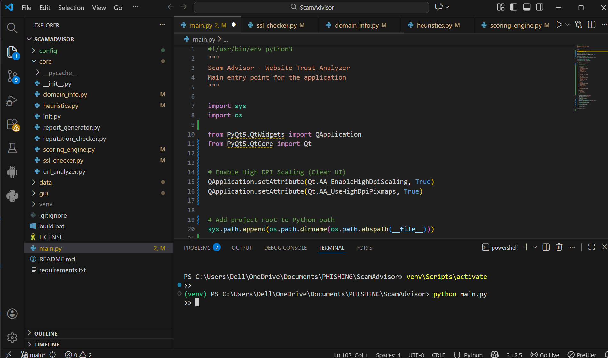
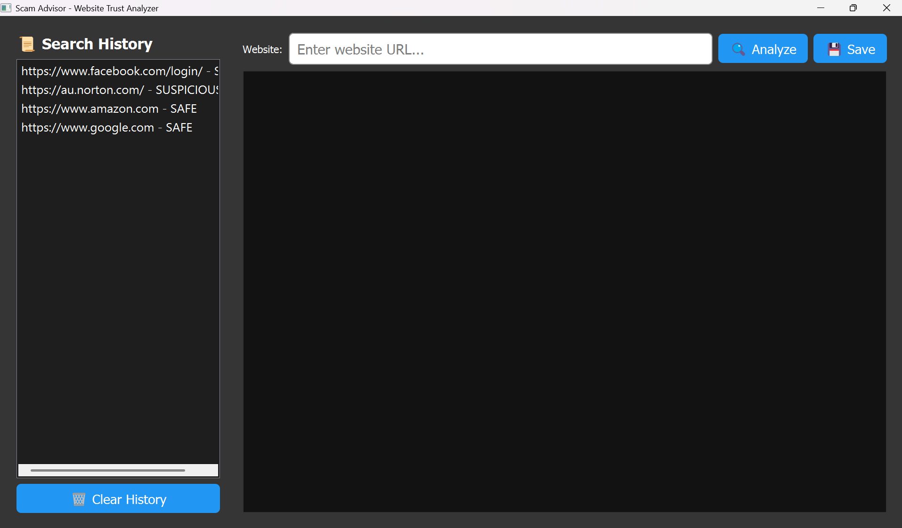
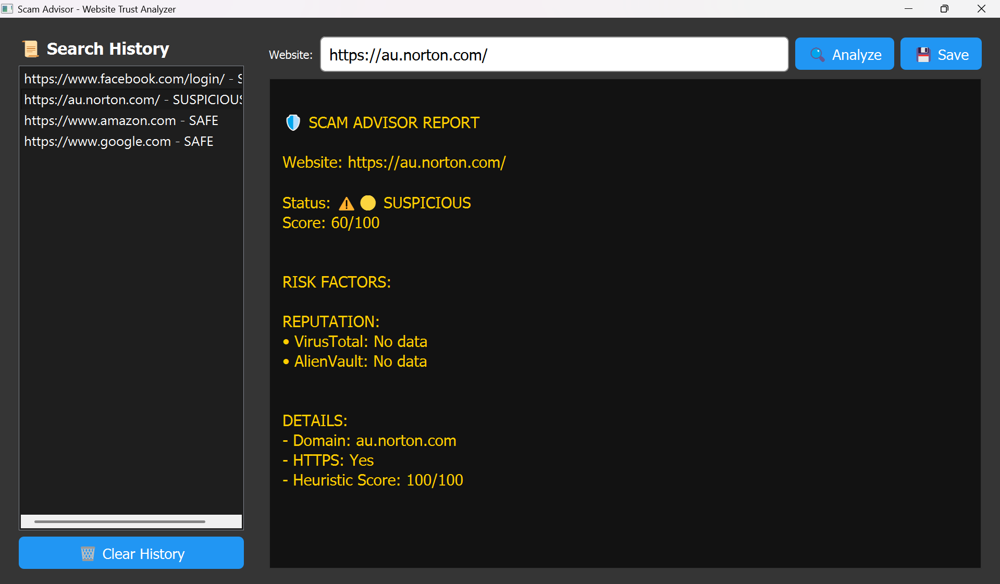

# 🛡️ ScamAdvisor - AI-Based Website Trust Analyzer

## 🚀 Overview

ScamAdvisor is an intelligent system that analyzes websites and detects whether they are safe or malicious. It helps users identify phishing websites and avoid online scams using Machine Learning techniques.

---

## 🌍 Why This Project?

With the increasing number of phishing attacks and online scams, users often struggle to identify malicious websites. ScamAdvisor provides a simple and effective solution to enhance online safety.

---

## ⚙️ How It Works

1. 🔗 User enters a website URL  
2. 🧹 The system extracts features (URL structure, HTTPS, patterns)  
3. 🧠 A Machine Learning model analyzes the features  
4. 📊 The system predicts:
   - ✅ Safe  
   - ⚠️ Suspicious  
   - 🚨 Malicious  
5. 📢 Results are displayed with risk indication  

---

## 🌟 Features

- 🔍 Real-time website analysis  
- 🚨 Phishing detection using ML  
- 🔐 SSL verification  
- 📊 Risk score generation  
- 🖥️ User-friendly interface  

---

## 🔧 Installation

```bash
git clone https://github.com/GVethaNarayanan/Phishing-Detection-Sys.git
cd Phishing-Detection-Sys
pip install -r requirements.txt
python main.py

## 📸 Screenshots

### Main Interface  


### Analysis Result  


### Result Screen  


📞 Contact

GitHub: https://github.com/GVethaNarayanan

📄 License

MIT License
